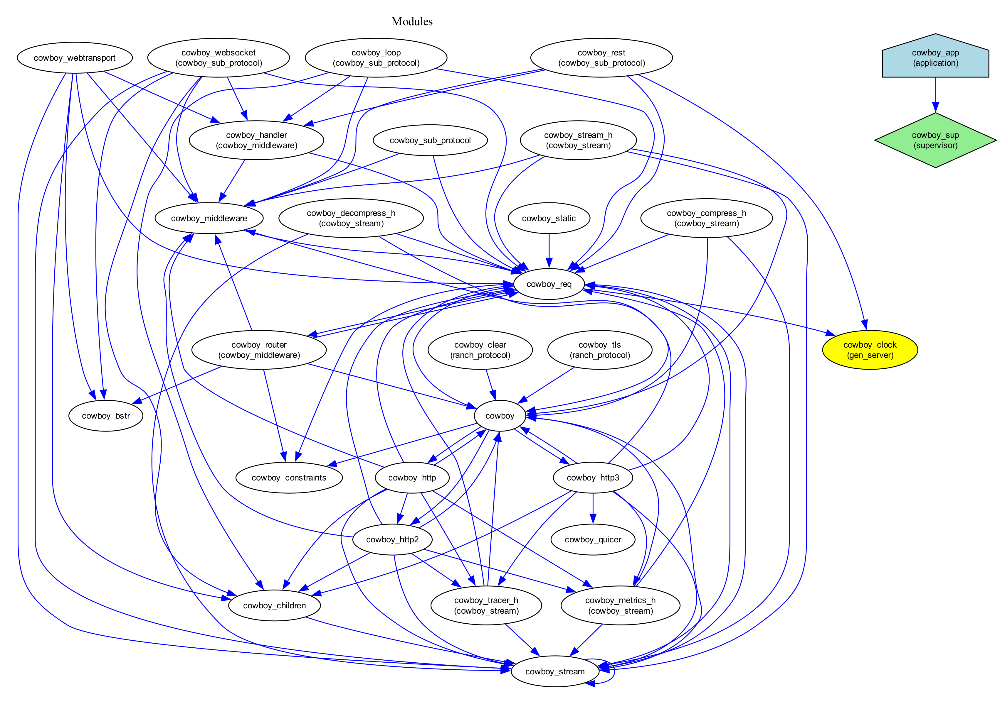
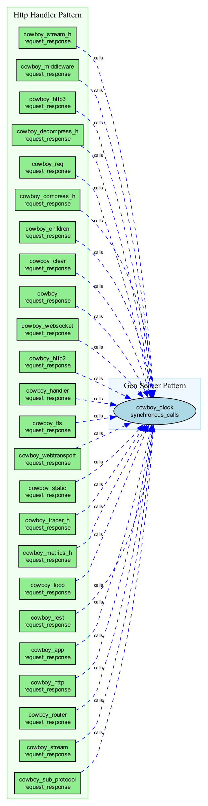
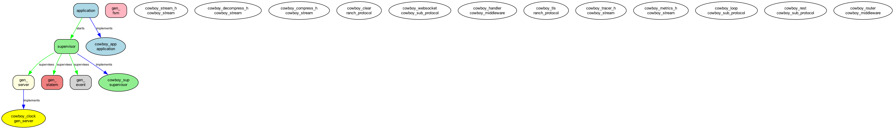

# Cowboy HTTP Server Analysis

This directory contains ErlViz analysis results for the [Cowboy HTTP server](https://github.com/ninenines/cowboy) project.

## Project Overview

**Cowboy** is a small, fast, modern HTTP server for Erlang/OTP. It provides a complete HTTP stack including HTTP/1.1, HTTP/2, and WebSocket support.

## Analysis Results

### Statistics
- **Total Modules**: 29
- **Behavior Modules**: 1  
- **Architecture**: Web Application/API Server
- **Complexity**: High
- **OTP Compliance**: Medium

### Key Findings

**OTP Behaviors Detected:**
- `application` behavior (cowboy_app)
- `supervisor` behavior (cowboy_sup)
- Custom behaviors like `cowboy_stream`, `cowboy_middleware`

**Module Categories:**
- **Protocol Handlers**: HTTP/1.1, HTTP/2, HTTP/3, WebSocket
- **Stream Processing**: Request/response streaming
- **Middleware**: Request processing pipeline
- **Utilities**: Constraints, compression, static files

**Communication Patterns:**
- Request-response cycles
- Stream processing chains
- Middleware pipelines
- Protocol upgrades

## Visualizations

### Dependency Graph

Shows the relationships between Cowboy's 29 modules, with clear clustering by functionality.

### Communication Diagram  

Illustrates the flow of data and control through Cowboy's architecture.

### Behavior Hierarchy

Displays the OTP supervision tree and behavior implementations.

## Technical Insights

**Architecture Highlights:**
- Clean separation between protocol implementations
- Modular middleware system for request processing
- Efficient stream handling for HTTP/2 and HTTP/3
- Comprehensive static file serving
- Built-in compression and decompression

**Design Patterns:**
- Behavior-based modularity
- Pipeline processing (middleware)
- Protocol abstraction layers
- Resource-efficient streaming

This analysis demonstrates how ErlViz can reveal the sophisticated architecture of production Erlang applications, making it easier to understand complex codebases and their OTP design patterns.

---
*Generated with ErlViz v1.0.0 - Erlang Project Analyzer and Visualizer*
